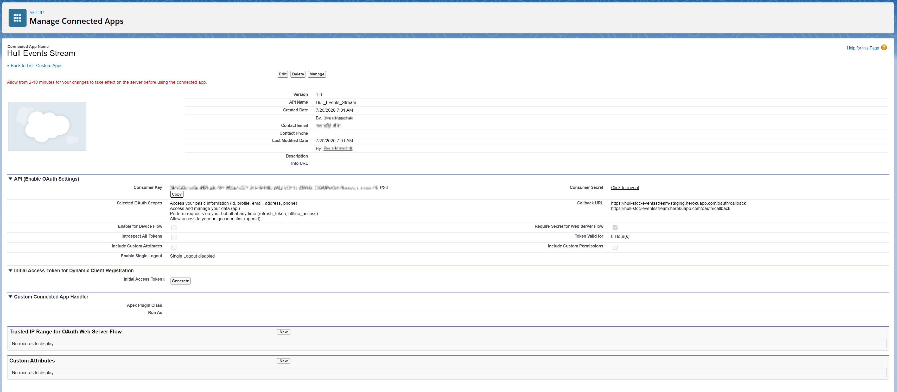
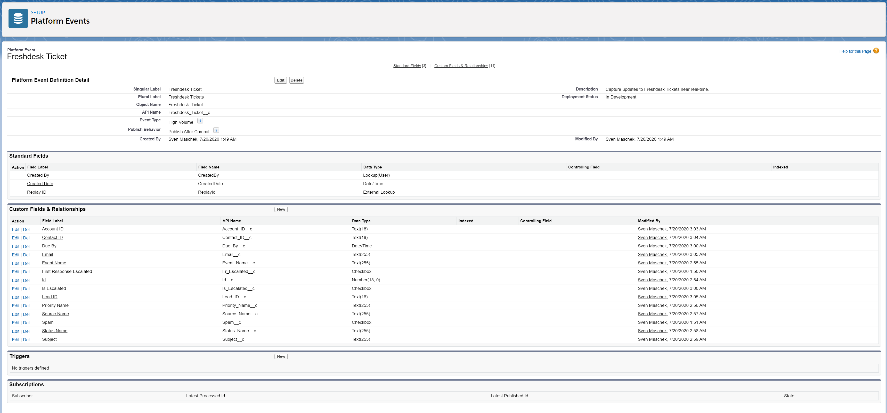
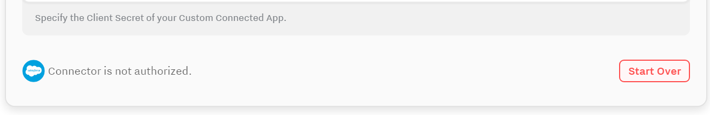

# Hull Salesforce Events Stream

This Salesforce Connector allows you to stream Hull Events near real-time to Salesforce using Platform Events.
It effectively decouples Hull and Salesforce and enables you to push high-volume events to Salesforce which you can leverage in your own APEX code or if you prefer to go no-code/low-code to leverage the Flow Builder and build your own logic in Salesforce.

## Getting Started

To start sending Hull events as Salesforce Platform Events, you need to **set up a few things in Salesforce** first:

- Create a Connected App
- Define a Platform Event

### Create a Connected App

You need a Connected App to authorize the connection between Hull and Salesforce. To create a Connected App, you can follow the steps below:

1. From Setup, enter App Manager in the Quick Find box, then select **App Manager**.
2. On the App Manager page, click **New Connected App**.
3. For Connected App Name, enter some recognizable name, e.g. Hull Events Stream.
4. For API Name, accept the suggestion or enter a unique name.
5. For Contact Email, enter your email address.
6. In the section API (Enable OAuth Settings), make sure **Enable OAuth Settings** is checked.
7. For Callback URL, enter [https://hull-sfdc-eventsstream-staging.herokuapp.com/oauth/callback](httpshull-sfdc-eventsstream-staging.herokuapp.com/oauth/callback) and [https://hull-sfdc-eventsstream.herokuapp.com/oauthcallback](https://hull-sfdc-eventsstream.herokuapp.com/oauth/callback) in separate lines.
8. For **Selected OAuth Scopes**, select
   a. Access and manage your data (api)
   b. Access your basic information (id, profile, email, address, phone)
   c. Allow access to your unique identifier (openid)
   d. Perform requests on your behalf at any time (refresh_token, offline_access)
9. Click **Save** at the bottom of the page and then click Continue.
10. Copy the **Consumer Key** which is the Client ID in your Hull Configuration and the **Consumer Secret** which is the Client Secret in Hull.

### Define a Platform Event

This Connector transforms Hull Events into Salesforce Platform Events. There is a naming convention to automatically transform Hull event properties to Custom Fields of a Salesforce Platform Event. Hull event properties are snake cased, for example `status_name` and per naming convention the repsective Custom Field in Salesforce must have the API Name start cased, in the example it will have to become `Status_Name`. If you do not follow this naming convention, properties will not be synchronized.

Follow the steps below to create your first Custom Event:

1. From Setup, enter Platform Events in the Quick Find box, then select Platform Events.
2. On the Platform Events page, click New Platform Event
3. For Label, enter the singular name of the event to capture, e.g. Freshdesk Ticket.
4. For Plural Label, enter the pluralized name of the event to capture, e.g. Freshdesk Tickets.
5. For Description, enter a short and concise description, e.g. Capture updates to Freshdesk Tickets near real-time.
6. For Publish Behavior, keep the default of Publish After Commit.
7. Navigate to the detail page of the newly created Platform Event, and click on New in the section Custom Fields & Relationships to create the properties of the event.

Please not that there are several pre-defined Custom Fields. Please refer to the section **Predefined Custom Fields** in this documentation.

Now Salesforce is ready to accept the Platform Events from Hull and you can focus on the **Connector Setup**.

1. Navigate to the section **Connection**.
2. Choose whether to connect to a `production` or `sandbox` environment for **Salesforce Environment**.
3. For **Salesforce API Version**, select one of the supported versions. The default is `v49.0`.
4. For **Salesforce OAuth Client ID**, enter the Consumer Key of your Connected App.
5. For **Salesforce OAuth Client Secret**, enter the Consumer Secret of your Connected App.

Save your changes and click on **Start Over** to start the authentication process:

_Note_: If you are receiving an error when clicking Start Over, you might need to refresh the page and try again.

Now that the Connector is authorized, you can move on to configure the data flow:

1. Navigate to the section **Data Flow**.
2. For **Event Mappings**, define at least one entry where you pick an event in Hull and the corresponding Platform Event in Salesforce.
3. For **user_synchronized_segments**, select the user segment or user segments you want to synchronize data for. You can also select the pre-defined All Users segment to send the events configured in the previous step for all users.
4. For **Send only for existing Contacts or Leads?**, choose whether to enable it or not. If you want to send only event data for Hull Users which represent an existing Lead or Contact in Salesforce, you should enable this setting.

Save your changes and you have successfully configured the event stream into Salesforce.

## Predefined Custom Fields

There are several pre-defined Custom Fields the Connector populates for Platform Events which carry basic user and event information. Please refer to the table below and configure the fields accordingly for your respective Platform Events.

| API Name           | Mandatory | Description                                                                                                                                                                                |
| ------------------ | --------- | ------------------------------------------------------------------------------------------------------------------------------------------------------------------------------------------ |
| `Event_Name`       | Yes       | The name of the event in Hull.                                                                                                                                                             |
| `User_Email`       | No        | The `email` address of the user in Hull.                                                                                                                                                   |
| `User_External_ID` | No        | The `external_id` of the user in Hull.                                                                                                                                                     |
| `Contact_ID`       | No        | The ID of the Salesforce Contact stored in the attribute `salesforce_contact/id` of the user in Hull.                                                                                      |
| `Lead_ID`          | No        | The ID of the Salesforce Lead stored in the attribute `salesforce_lead/id` of the user in Hull.                                                                                            |
| `Account_ID`       | No        | The ID of the Salesforce Account stored in the attribute `salesforce/id` of the account in Hull which is related to the given user. If no account is linked in Hull, this will be omitted. |

## FAQ

### Where can I learn more about Platform Events

Salesforce Trailhead has some great resources around Platform Events. You can get started with [Platform Events Basics Module](https://trailhead.salesforce.com/content/learn/modules/platform_events_basics) to learn more.

### What does high-volume mean in the context of Platform Events

Salesforce recommends to stay below 5 million Platform Events a day. For further information please consult the Salesforce documentation or your Salesforce Representative.

### Why is there a naming convention

To ensure that the Connector can detect Custom Fields reliable, a naming convention was put in place.
Hull event properties are snake cased, however this is not a common naming convention in Salesforce which is why the Connector expects the API Name in Salesforce the be start cased. For example if the event property in Hull is named `is_escalated`, the corresponding API Name should be `Is_Escalated`. Salesforce will automatically append `__c` to the Custom field, so do not enter this suffix when creating the Custom Field.

### I don't see my newly created Platform Event in the dropdown list

The Connector caches automatically the Metadata for 5 minutes when you interact with the **Settings** screen to reduce the number of API calls. Please wait 5 minutes and reload the Settings page.
